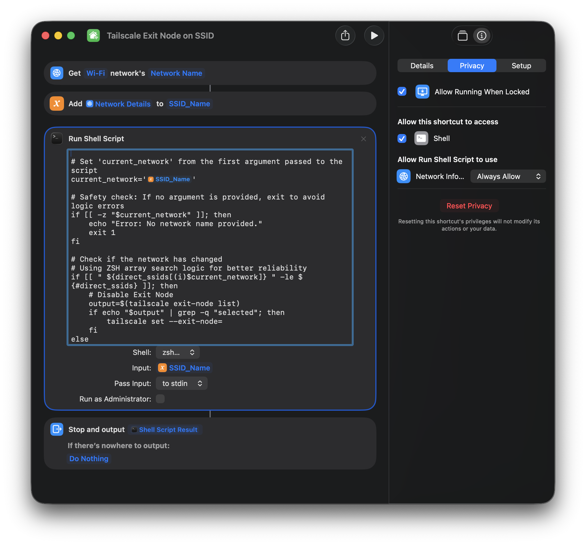

# macOS Tailscale - Automatically Connect to Exit Node by SSID

## **Why the Shortcuts app?** *On macOS 10.14 and before, macOS allowed multiple ways to retrieve the active SSID via the terminal; however, as of macOS Tahoe (26), Apple has redacted the names of SSIDs being shared through terminal commands in order to prevent unscrupulous applications from tracking network changes (and potentially inferring location). Currently the Shortcuts app is the only way (known to me at least) that you can explicitly allow passing the current SSID as a variable into a command (without having to use elevated privileges, i.e. `sudo`).*

1. Edit `shortcutShellScript.sh` and modify the `trusted_ssids` variable to include a list of trusted SSIDs for which you do NOT want the Tailscale Exit Node to activate on

```bash
trusted_ssids=("Trusted SSID 1" "Trusted SSID 2")
```

2. Create a macOS Shortcut in the Shortcuts app according to the image below. For the shell script, copy and paste the contents of `shortcutShellScript.sh` and save as `Tailscale Exit Node on SSID` 
3. Click the Run button on the top right of the Shortcuts window and accept the permissions then confirm the permissions are allowed for the following under the `Privacy` tab:
    - ✅ Allow Running When Locked
    - Allow this shortcut to access: ✅ Shell
    - Allow Run Shell Script to use: Network Info... `Always Allow`

4. Ensure `triggerTailscaleShortcut.sh` is configured to run the shortcut directly (no `sudo` required for LaunchAgents):

```bash
#!/bin/zsh
/usr/bin/shortcuts run "Tailscale Exit Node on SSID"
```

_NOTE: if you set a different name for the macOS Shortcut in step 2, update the name inside the quotes._

5. Create a local directory for the script, copy it over, and give it execute permissions:

```bash
mkdir -p ~/.local/bin
cp triggerTailscaleShortcut.sh ~/.local/bin/.
chmod +x ~/.local/bin/triggerTailscaleShortcut.sh
```

6. Copy the LaunchAgent `com.local.macosNetworkChange.plist` into your user `LaunchAgents` directory and load it using `launchctl`:

```bash
mkdir -p ~/Library/LaunchAgents
cp com.local.macosNetworkChange.plist ~/Library/LaunchAgents/.
launchctl bootstrap gui/$(id -u) ~/Library/LaunchAgents/com.local.macosNetworkChange.plist
```

*NOTE: If you want to disable the LaunchAgent in future, run `launchctl bootout gui/$(id -u) ~/Library/LaunchAgents/com.local.macosNetworkChange.plist`*
