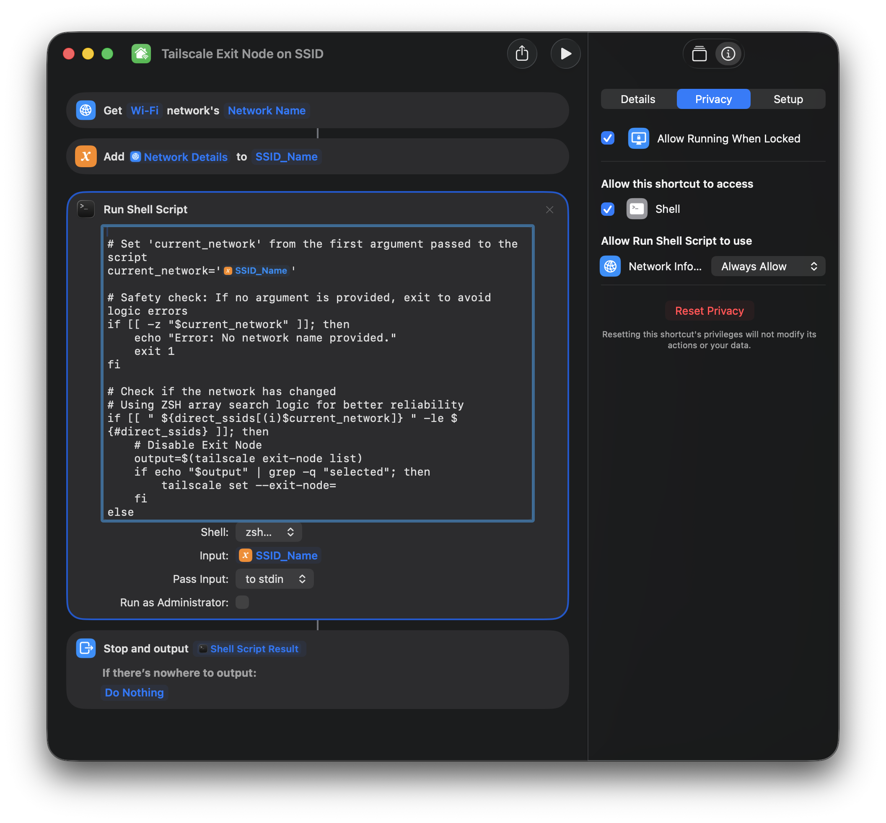

# macOS Tailscale - Automatically Connect to Exit Node by SSID

#### **Why the Shortcuts app?** *On macOS 10.14 and before, macOS allowed multiple ways to retrieve the active SSID via the terminal; however, as of macOS Tahoe (26), Apple has redacted the names of SSIDs being shared through terminal commands in order to prevent unscrupulous applications from tracking network changes (and potentially inferring location). Currently the Shortcuts app is the only way (known to me at least) that you can explicitly allow passing the current SSID as a variable into a command (without having to use elevated privileges, i.e. `sudo`).*

1. Edit `shortcutShellScript.sh` and modify the `trusted_ssids` variable to include a list of trusted SSIDs for which you do NOT want the Tailscale Exit Node to activate on
```
trusted_ssids=("Trusted SSID 1" "Trusted SSID 2")
```
2. Create a macOS Shortcut in the Shortcuts app according to the image below. For the shell script, copy and paste the contents of `shortcutShellScript.sh` and save as `Tailscale Exit Node on SSID` 
3. Click the Run button on the top right of the Shortcuts window and accept the permissions then confirm the permissions are allowed for the following under the `Privacy` tab:
    - ✅ Allow Running When Locked
    - Allow this shortcut to access: ✅ Shell
    - Allow Run Shell Script to use: Network Info... `Always Allow`
4.  Edit `triggerTailscaleShortcut.sh` and modify `{{REPLACE_WITH_LOCAL_USERNAME}}` to your username. \
*NOTE: if you set a different name for the macOS Shortcut in the previous step, update the name set inside the quotes where it states `Tailscale Exit Node on SSID`*
```
sudo -u {{REPLACE_WITH_LOCAL_USERNAME}} /usr/bin/shortcuts run "Tailscale Exit Node on SSID"
```
5. Create a directory in `/opt/`, copy `triggerTailscaleShortcut.sh` to it, then give execute permission, and finally give `root` user and `wheel` group ownership 
```
sudo mkdir /opt/ts-network-change 
sudo cp triggerTailscaleShortcut.sh /opt/ts-network-change/.  
sudo chmod +x /opt/ts-network-change/* 
sudo chown root:wheel /opt/ts-network-change/*
```
6. Copy the LaunchDaemon `com.local.macosNetworkChange.plist` into the `/Library/LaunchDaemons/` directory and load it into `launchctl`
```
sudo cp com.local.macosNetworkChange.plist /Library/LaunchDaemons/.
sudo launchctl load -w /Library/LaunchDaemons/com.local.macosNetworkChange.plist
```

*NOTE: If you want to disable the LaunchDaemon in future, run `sudo launchctl unload -w /Library/LaunchDaemons/com.local.macosNetworkChange.plist`*